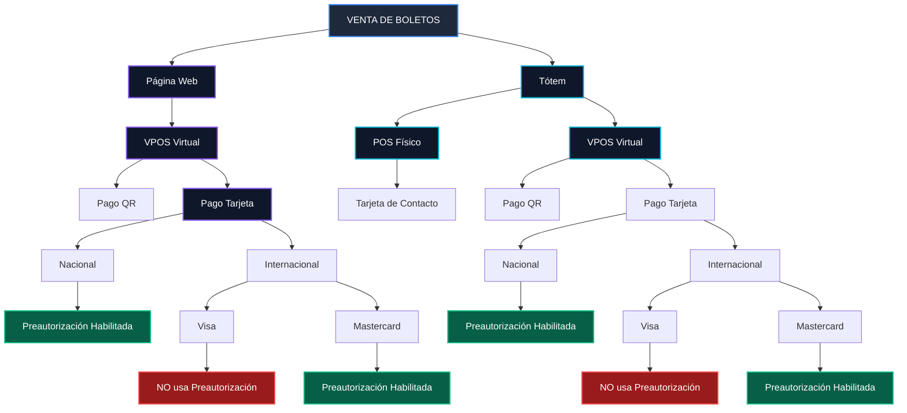

# Diagrama de Flujo - Venta de Boletos y Configuración de Pagos

Este documento contiene la arquitectura de flujo de la **Venta de Boletos**, los canales de cobro (**Página Web** y **Tótem**), métodos de pago (**VPOS Virtual**, **POS Físico**, **QR** y **Tarjeta**) y las reglas de **Preautorización** (**Nacional**, **Internacional - Visa / Mastercard**).

---

## 1. Diagrama de Texto Plano (Fuente reducida y contenedor ajustable)

<div style="background-color: #0f172a; border: 1px solid #334155; border-radius: 12px; padding: 20px; overflow-x: auto; margin-bottom: 24px;">
<pre style="font-family: 'Courier New', Courier, monospace; font-size: 11px; line-height: 1.15; color: #38bdf8; margin: 0; white-space: pre;">
===================================================================================================================================================================
                                                                        VENTA DE BOLETOS
===================================================================================================================================================================
                                                                               │
                       ┌───────────────────────────────────────────────────────┴───────────────────────────────────────────────────────┐
                       │                                                                                                               │
            ┌──────────▼──────────┐                                                                                         ┌──────────▼──────────┐
            │     PÁGINA WEB      │                                                                                         │        TÓTEM        │
            └──────────┬──────────┘                                                                                         └──────────┬──────────┘
                       │                                                                                                               │
               ┌───────▼───────┐                                                                                               ┌───────┴───────┐
               │ VPOS Virtual  │                                                                                               │               │
               └───────┬───────┘                                                                                       ┌───────▼───────┐ ┌─────▼─────┐
                       │                                                                                               │ VPOS Virtual  │ │POS Físico │
                       │                                                                                               └───────┬───────┘ └─────┬─────┘
                       │                                                                                                       │               │
                       │                                                                                                       │         ┌─────▼─────┐
                       │                                                                                                       │         │ Tarjeta   │
                       │                                                                                                       │         │ Contacto  │
                       │                                                                                                       │         └───────────┘
          ┌────────────┴────────────┐                                                                             ┌────────────┴────────────┐
          │                         │                                                                             │                         │
     ┌────▼────┐              ┌─────▼─────┐                                                                  ┌────▼────┐              ┌─────▼─────┐
     │ Pago QR │              │  Tarjeta  │                                                                  │ Pago QR │              │  Tarjeta  │
     └─────────┘              └─────┬─────┘                                                                  └─────────┘              └─────┬─────┘
                                    │                                                                                                       │
                       ┌────────────┴────────────┐                                                                             ┌────────────┴────────────┐
                       │                         │                                                                             │                         │
                  ┌────▼────┐              ┌─────▼─────┐                                                                  ┌────▼────┐              ┌─────▼─────┐
                  │Nacional │              │Internac.  │                                                                  │Nacional │              │Internac.  │
                  └────┬────┘              └─────┬─────┘                                                                  └────┬────┘              └─────┬─────┘
                       │                         │                                                                             │                         │
               ┌───────▼───────┐          ┌──────┴──────┐                                                             ┌───────▼───────┐          ┌──────┴──────┐
               │ Preautoriza   │          │             │                                                             │ Preautoriza   │          │             │
               │  Habilitada   │     ┌────▼────┐   ┌────▼────┐                                                        │  Habilitada   │     ┌────▼────┐   ┌────▼────┐
               └───────────────┘     │  Visa   │   │Mastercd │                                                        └───────────────┘     │  Visa   │   │Mastercd │
                                     └────┬────┘   └────┬────┘                                                                              └────┬────┘   └────┬────┘
                                          │             │                                                                                        │             │
                                     ┌────▼────┐   ┌────▼────┐                                                                              ┌────▼────┐   ┌────▼────┐
                                     │NO usa   │   │Preaut.  │                                                                              │NO usa   │   │Preaut.  │
                                     │Preaut.  │   │Habilit. │                                                                              │Preaut.  │   │Habilit. │
                                     └─────────┘   └─────────┘                                                                              └─────────┘   └─────────┘
</pre>
</div>

---

## 2. Desglose en Texto Plano por Canales

### 🌐 Canal 1: Página Web

```text
[ VENTA DE BOLETOS ]
   └── [ Página Web ]
        └── [ VPOS Virtual ]
             ├── [ 1. Pago QR ]
             └── [ 2. Pago Tarjeta ]
                  ├── [ A. Nacional ] ───────────────────► [ Preautorización Habilitada ]
                  └── [ B. Internacional ]
                       ├── [ B.1 Visa ] ───────────────► [ NO usa Preautorización ]
                       └── [ B.2 Mastercard ] ─────────► [ Preautorización Habilitada ]
```

---

### 🖥️ Canal 2: Tótem

```text
[ VENTA DE BOLETOS ]
   └── [ Tótem ]
        ├── [ POS Físico ] ─────────────────────────────► [ Tarjeta de Contacto ]
        └── [ VPOS Virtual ]
             ├── [ 1. Pago QR ]
             └── [ 2. Pago Tarjeta ]
                  ├── [ A. Nacional ] ───────────────────► [ Preautorización Habilitada ]
                  └── [ B. Internacional ]
                       ├── [ B.1 Visa ] ───────────────► [ NO usa Preautorización ]
                       └── [ B.2 Mastercard ] ─────────► [ Preautorización Habilitada ]
```

---

## 3. Diagrama Visual (Mermaid)



---

## 4. Resumen de Reglas de Negocio

| Canal | Tipo de Tarjeta / Marca | ¿Usa Preautorización? | `preauthorization` Payload | Acciones en Confirmación |
|---|---|---|---|---|
| Web / Tótem | Tarjetas Nacionales | **Sí** | `true` | Se realiza `/confirmar-transaccion` tras emitir boletos |
| Web / Tótem | Internacional - Mastercard | **Sí** | `true` | Se realiza `/confirmar-transaccion` tras emitir boletos |
| Web / Tótem | Internacional - VISA | **No** (Venta Directa) | `false` | Se omite `/confirmar-transaccion` (cobro automático) |
